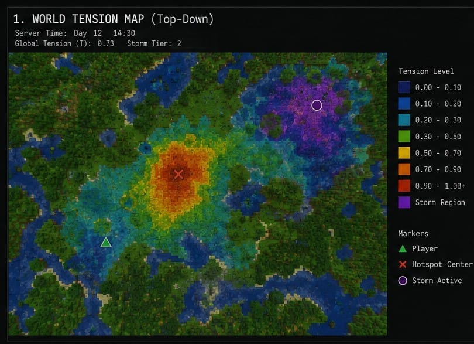
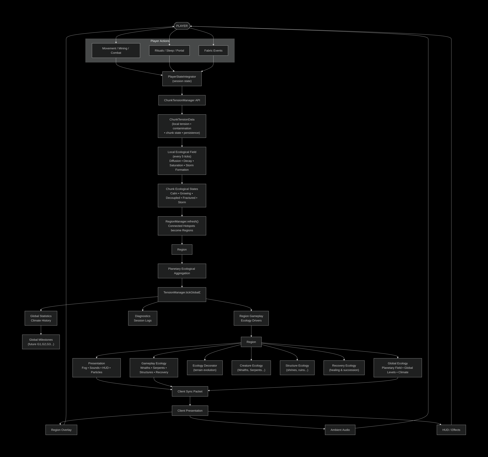

# UTD Mod - DCII Tension System (Minecraft 1.20.4 Fabric)

**Technical implementation of Substrate X–style “world tension” dynamics**


For related work, check out https://github.com/brayo003/Substrate-X-Theory-of-Information-Gravity


UTD Mod adds a persistent world-state field to Minecraft. Player activity alters regional tension, tension diffuses through chunks, accumulates history, and drives world events.


This repository contains a Fabric mod that adds a server-authoritative tension field to Minecraft. The current implementation focuses on global tension state, chunk-level coupling, region-based diagnostics, and server-to-client sync for overlays and audio.

<p align="center">
  
</p>

This README summarizes the systems that are present in the current codebase and avoids claiming features that are not yet implemented or verified.

## What the code actually implements

### Global tension (`com.utdmod.core.TensionManager`)

Each server tick the mod updates a scalar `T` with:

- **Decay:** linear term proportional to `T`
- **Nonlinear feedback:** a `T²` amplification term (capped by a hard max)
- **Inflow:** movement-derived continuous inflow plus an **event buffer** (mining, combat hooks, etc.) that decays after application

Storm and corruption tiers are driven from this same state (thresholds + hysteresis where applicable).

### Chunk field (`ChunkTensionData` + `TensionServerTick`)

On a slower cadence, the server walks chunks that carry tension and applies a **discrete reaction–diffusion–style** update: neighbor averaging (diffusion-like), local nonlinear growth, cubic damping, coupling from global `T`, optional local storm drain, and caps. Global `T` is then **weakly coupled** back toward the spatial average.

This is **not** the gradient–excitation–damping formula from older docs; it is an explicit **dynamical update rule** tuned for gameplay.

### Client mirror (`com.utdmod.client.TensionSyncState`)

The client **never** runs `core.TensionManager`. It only reads `CLIENT_TENSION` / `CLIENT_STORM`, updated from `TensionSyncPacket` sent by the server.

## Architecture (post-refactor)

The current structure is centered on a single server-side tension pipeline with a lightweight client mirror for HUD and audio feedback.

<div align="center" style="max-width: 100%; overflow: auto; border: 1px solid #d0d7de; border-radius: 8px; padding: 8px; background: #0f172a;">
  
</div>

| Layer | Responsibility |
|--------|------------------|
| `core.TensionManager` | Single server source of truth for global tension + storm flag |
| `TensionServerTick` | One `END_SERVER_TICK` pipeline: inflow → global tick → chunk field → weather/secondary hooks → broadcast sync |
| `TensionSyncState` | Client snapshot for overlays, audio, and any client-only consumers |
| `TensionSyncPacket` | Server → client snapshot |

## Why this exists

Minecraft worlds eventually become static.
This system attempts to give the world memory,
regional state, and long-term evolution.

## Status

- Mod loads; **single global tension + chunk map + sync** share one server pipeline.
- Content: blocks, items, entities, block entities register from `UTDMod` init.
- Further work: spawn rules, entity render registration, HUD polish, and balancing.

## Build

```bash
./gradlew build
```

## Collaboration

Looking for Fabric/Java developers to extend the DCII-style framework in Minecraft.
